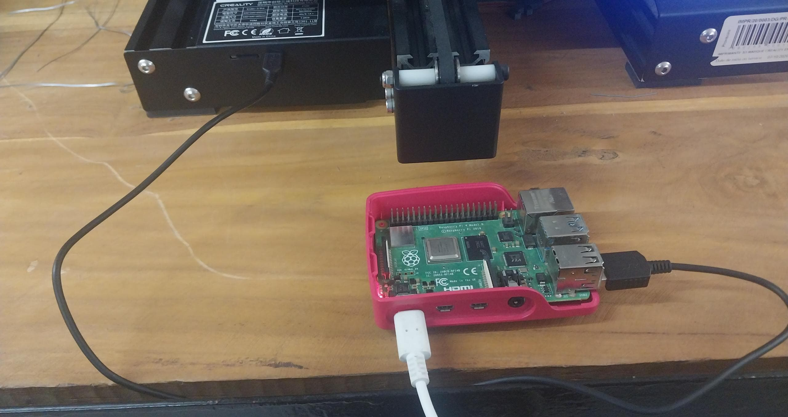
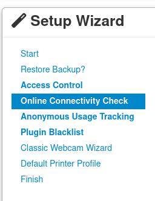
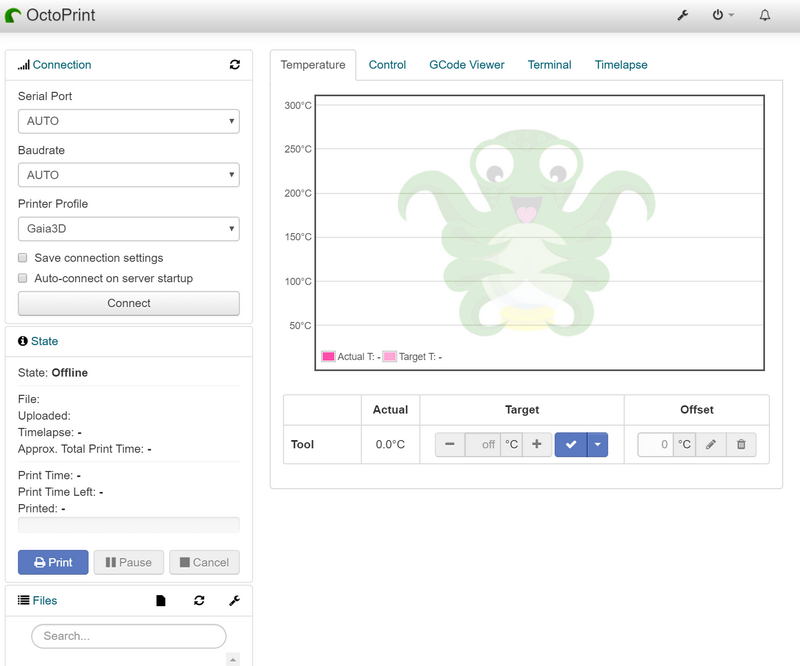
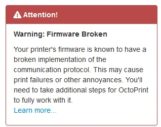

# Connexion de Octoprint à l’imprimante 3D

## Branchement

Votre Raspberry Pi éteinte, connectez votre micro processeur à l’imprimante 3D avec le bon câble USB. Une fois cela fait, allumez l’imprimante 3D, connectez le Pi à une source d’énergie et allumez-le.

Vous pouvez vous munir d'un écran à brancher via HDMI avec le Pi pour suivre l'application de toutes les configurations faites. Pour une première fois, cela peut prendre un peu de temps mais après ce sera beaucoup plus rapide. Vous savez que l'opération est terminée lorsque vous voyez un prompt qui vous invite à vous connecter.

## Accès à Octoprint

Après un démarrage réussi, connectez vous via n'importe quel navigateur mais sur le réseau qui a été configuré avec OctoPi. 
Pour accéder a l'interface web d'Octoprint, vous pouvez utiliser une de ces 2 URLs:

**http://[nom].local/** avec nom, le nom d'hote que vous auriez mis lors de l'installation de l'image de OctoPi
**http://[ip]** avec ip, l'adresse ip de la raspberry

## Configuration des paramètres

Les principaux paramètres incluent:

###### Le controle d'accès
Vous devez y renseigner le nom d'utilisateur et le mot de passe nécessaires pour se connecter à l'interface web d'Octoprint. 

###### Le suivi anonyme de l’utilisation
Vous décidez si vous souhaitez qu'OctoPrint collecte de manière anonyme ou non des données de votre part.

###### Vérification de la connectivité en ligne

###### La liste noire de plugins
Vous pouvez sélectionner certains plugins que vous mettrez dans votre liste noire.

###### La configuration du profil de l'imprimante
Vous devez mettre un nom pour votre imprimante et renseigner les valeurs correspondantes à votre imprimante.

###### Les commandes du serveur
Vous pouvez configurer les commandes du serveur qu’OctoPrint prendra en charge. 

###### Les enregistrements par webcam et en accéléré
Vous pouvez configurer les paramètres de votre webcam et mettre en place des enregistrements en accéléré.
Des lors, des que vous cliquez sur "Next" ou "Suivant", vous tomberez sur la page d'Octoprint en elle meme.

## Apercu initial d'Octoprint
Voici comment se presente Octoprint juste avant la connexion :

## Connexion
Au niveau des paramètres en haut à gauche, cochez les cases **Save connection settings** et **Auto-connect on server startup**.
Laissez **Serial Port** et **Baudrate** définis sur **AUTO**.
Cliquez ensuite sur **Connect** et c'est bon.

Vous n'aurez à faire cette étape qu'une fois.
Toutes les autres fois, votre imprimante sera connectée à moins que vous vous soyez déconnecter.
Par ailleurs, vous devez faire très attention aux warnings qui apparaitront sur la page de connexion:

#### Undervoltage Problem

Si vous avez une erreur du type **Undervoltage detected**, il s'agit du fait que votre raspberry recoit une tension inférieure à celle dont elle a besoin et cela peut affecter la qualité de vos impressions. De ce fait, je vous recommande de, soit changer le chargeur de votre raspberry (car inadéquat), soit relier l'alimentation de votre raspberry pi à celle de votre imprimante tout en vous assurant dans les 2 cas qu'une tension d'au moins **5V** est delivrée a la raspberry.

#### Firmware Problem

Si vous avez une erreur du type **Firmware Broken**, cela indique un problème au niveau du protocole de communication entre ton imprimante 3D et Octoprint. Néanmoins, cela peut etre réglé avec l'installation du plugin **Creality-2x-temperature-reporting-fix**
Pour l'installation du plugin : 

Allez dans les paramètres en cliquant sur l'icone en forme de clé.

Cliquez sur **Plugin Manager** puis sur **Get more**.

Entrez **Creality-2x-temperature-reporting-fix** au niveau de la barre de recherche puis sur **Install**.

Suivez ensuite les instructions pour redémarrer Octoprint.

## Description des éléments de base d'Octoprint

##### Temperature
C'est un composant qui permet de surveiller et de contrôler les températures de l'imprimante 3D. Il affiche les températures actuelles des extrudeurs, du lit chauffant et éventuellement d'autres composants. Vous pouvez ajuster les températures cibles et surveiller les changements en temps réel.

##### Control
Cet élément vous permet de contrôler les mouvements de l'imprimante 3D. Vous pouvez démarrer, mettre en pause, reprendre ou arrêter l'impression en cours. Vous pouvez également déplacer manuellement l'extrudeur et le plateau chauffant selon les axes X, Y et Z.

##### GCode Viewer
Le visualiseur de GCode affiche le modèle 3D en cours d'impression sous forme de représentation graphique. Il vous permet de suivre la progression de l'impression couche par couche et de repérer d'éventuels problèmes ou erreurs dans le modèle.

##### Terminal
Le terminal fournit une interface en ligne de commande pour communiquer directement avec l'imprimante 3D via OctoPrint. Vous pouvez envoyer des commandes GCode personnalisées, vérifier le statut de l'imprimante et afficher les messages de retour pour diagnostiquer les problèmes.

##### Timelapse
La fonction de timelapse permet de capturer des séquences vidéo de l'impression en cours. Cela vous permet de créer des vidéos accélérées montrant tout le processus d'impression, ce qui peut être utile pour surveiller l'avancement à distance ou pour partager des vidéos de vos créations avec d'autres personnes.
