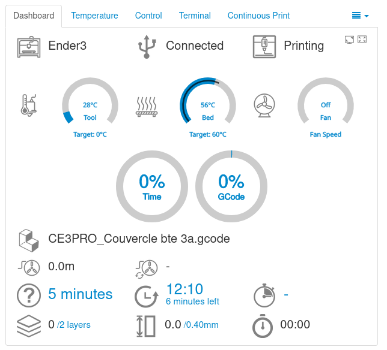

# Mécanisme de mise en place d’un Dashboard

## Dashboard
Le plugin Dashboard d'OctoPrint fonctionne en interagissant avec différentes parties du système OctoPrint ainsi qu'avec des composants externes, le cas échéant, pour collecter les données pertinentes à afficher sur le tableau de bord. Voici quelques points clés sur son fonctionnement :

- Intégration avec OctoPrint : Le plugin utilise les API (interfaces de programmation d'applications) fournies par OctoPrint pour accéder aux données et aux fonctionnalités de base de l'imprimante 3D et de l'environnement d'impression.

- Collecte de données en temps réel : Le plugin interroge périodiquement OctoPrint pour récupérer des informations en temps réel sur l'état de l'imprimante, telles que les températures actuelles, l'avancement de l'impression, l'utilisation des ressources du système (CPU, mémoire, etc.), et d'autres données pertinentes.

- Configuration personnalisée : L'utilisateur peut configurer le plugin selon ses préférences en activant ou en désactivant les différentes catégories d'informations qu'il souhaite voir affichées sur le tableau de bord. Cette personnalisation permet à chaque utilisateur d'adapter le tableau de bord à ses besoins spécifiques.

- Affichage dynamique : Une fois que les données sont collectées, le plugin les présente de manière organisée et conviviale sur le tableau de bord. Les informations sont mises à jour en temps réel pendant l'impression, offrant ainsi une surveillance en direct de l'état de l'imprimante et de l'avancement du travail.

- Intégration avec des périphériques externes : Dans certains cas, le plugin peut également interagir avec des périphériques externes, tels que des capteurs de température et d'humidité, des webcams pour la visualisation en direct, ou d'autres appareils connectés, pour fournir des informations supplémentaires et enrichir l'expérience utilisateur.

En combinant toutes ces fonctionnalités, le plugin Dashboard d'OctoPrint offre une solution pratique pour surveiller et gérer les impressions 3D en cours, en fournissant aux utilisateurs un accès facile à toutes les informations pertinentes au même endroit.

## Installation du plugin

Pour l'installation du plugin : 

Allez dans les paramètres en cliquant sur l'icone en forme de clé

Cliquez sur **Plugin Manager** sous OCTOPRINT puis sur **Get more**

Entrez **A AJOUTER** au niveau de la barre de recherche puis sur **Install**

Suivez ensuite les instructions pour redémarrer Octoprint

## Parametrage du plugin

Lors du paramétrage du plugin, l'utilisateur a la possibilité d'activer les éléments qu'il souhaite afficher sur son dashboard pendant une impression et de désactiver ceux qu'il ne désire pas voir.

## Apercu du plugin

Le dashboard affiche, pendant une impression, tous les éléments qui ont été activés lors du paramétrage. Il peut afficher les paramètres suivants :

- Charge du CPU de l'hôte RPi, température du CPU, fréquence du CPU, utilisation de la mémoire, utilisation du stockage.
- Profil de l'imprimante, état de la connexion, état de l'imprimante
- Températures de l'élément chauffant, température du lit, température de la chambre, vitesse du ventilateur.
- Capteurs de température et d'humidité.
- Sortie de la commande Shell
- Fichier imprimé, progression du travail, progression de la couche.
- Graphique de la durée des couches
- Temps total estimé, ETA, Temps restant, Temps depuis le début de l'impression
- Couche actuelle, Total des couches
- Hauteur actuelle, Hauteur totale
- Durée moyenne du calque
- Vue de la webcam

