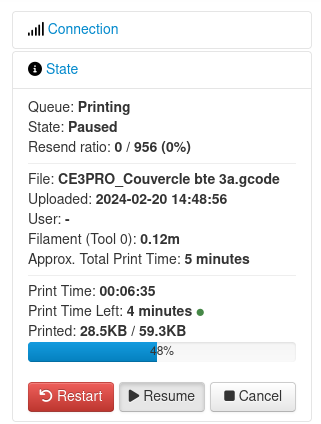
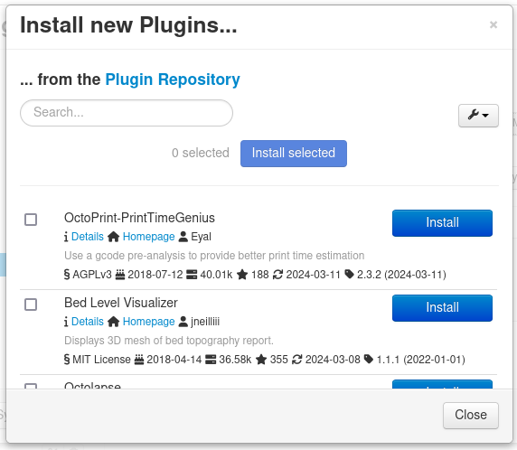
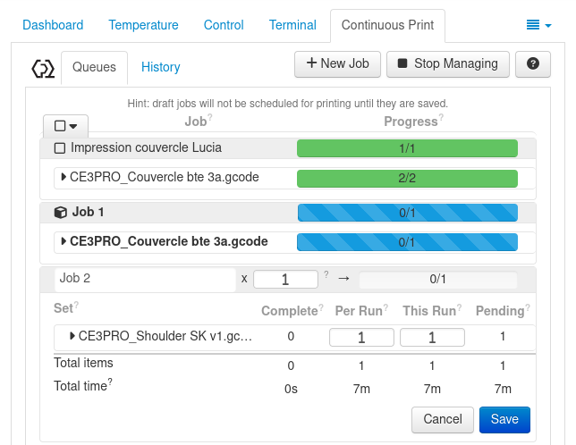
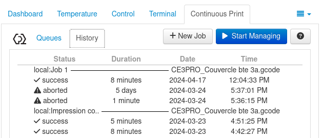

# Mécanisme de mise en place de liste d’attente

## Utilité de la liste d'attente

La file d'attente présente une utilité indéniable : même lorsqu'une impression est en cours, il est possible d'ajouter plusieurs autres impressions dans l'ordre souhaité. Ainsi, dès qu'une impression est terminée, il suffit de :

1. Retirer du plateau ce qui a ete imprimé

2. Appuyer sur le bouton **Resume** pour que l'impression suivante dans la file d'attente démarre. Cette action est valable aussi bien pour un nouvel objet à imprimer que pour la répétition d'un objet déjà imprimé à plusieurs reprises.

## Approche
Pour mettre en place une file d'attente, j'ai initialement exploré la liste des plugins fournis par OctoPrint dans cette optique. Le premier plugin que j'ai installé, **OctoPrint-Queue**, semblait répondre à un besoin principal : l'assignation d'une impression à une personne. Je pensais que cela simplifierait les processus d'envoi de notifications. Cependant, ce plugin ne permettait pas vraiment de créer une file d'attente comme décrit dans sa description : il n'était pas possible d'ajouter des impressions l'une après l'autre.

Après de multiples recherches pour trouver un moyen de créer ma file d'attente, j'ai découvert un plugin qui, bien qu'il ne permette pas d'assigner une impression à une personne, autorisait effectivement l'ajout d'impressions les unes après les autres. Il s'agit de **Continuous Print**.

## Installation du plugin Continuous Print

Pour l'installation du plugin : 

Allez dans les paramètres en cliquant sur l'icone en forme de clé

Cliquez sur **Plugin Manager** puis sur **Get more**

Entrez **Continuous Print** au niveau de la barre de recherche puis sur **Install**

Suivez ensuite les instructions pour redémarrer Octoprint

## Paramètrage du plugin Continuous Print

Lors du paramètrage du plugin, vous aurez la possibilité d'activer les paramètres que vous voulez afficher sur votre liste d'attente pendant une impression et désactiver ceux que vous ne désirer pas voir.

## Apercu du plugin Continuous Print

Le liste d'attente affichera lors d'une impression tout ce qui aurait été activé lors du paramètrage. Dans ce cas par exemple, on a accès à toutes les impressions (job et leurs détails(quantité à faire, impression réussie ou non, temps d'impression, quantité de consommable utilisé).

