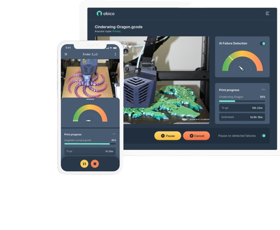
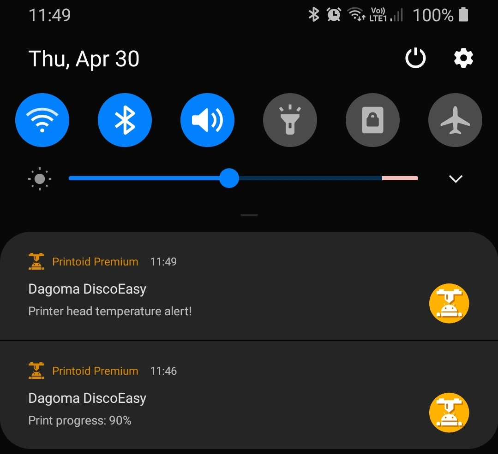

# Mécanisme d’envoi de notifications

Pour l'envoi des notifications, j'avais opté pour l'envoi de courriels directement via Octoprint. Dans cette optique, j'ai exploré la mise en œuvre du processus à travers un plugin nommé **OctoText**.

OctoText est un plugin de notification permettant d'envoyer des messages textuels ou des courriels en réponse à des événements configurables de l'imprimante. Tout ce qui est nécessaire, c'est un compte de messagerie électronique ! L'état de l'imprimante, ainsi qu'une capture d'écran de la webcam si elle est configurée, seront envoyés soit par courriel, soit par SMS.

Cependant, malgré toutes les configurations effectuées, le plugin indiquait avoir envoyé les courriels, mais ceux-ci n'étaient jamais reçus, que ce soit avec une adresse Gmail ou Outlook.

Par conséquent, j'ai opté pour une autre solution : l'installation d'une application permettant de suivre l'évolution des impressions directement sur son téléphone portable. Cette application s'appelle **Obico**.

##Obico pour Octoprint

Obico est une application offrant un accès complet aux fonctionnalités d'Octoprint, avec en prime la réception de notifications en temps réel. En effet, Obico envoie des notifications pour le début et la fin d'une impression, ainsi que pour les pourcentages d'avancement des impressions.

**NB:**
Lorsque la webcam n'est pas encore installee et configuree, Obico envoie des alertes comme celles ci: **Webcam streaming not working in OctoPrint** qui sera affichee dans un cadran rouge en haut a droite sur la page de Octoprint. Vous pouvez egalement recevoir cette alerte directement sur votre appareil via Obico.

