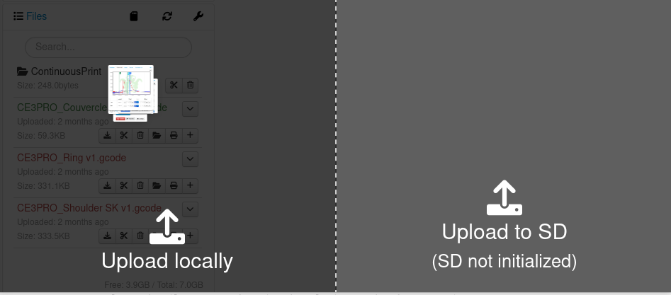
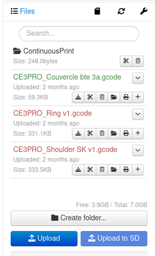

# Lancement de la première impression via Octoprint

Lors de la première impression via Octoprint, il faut:

1. Soit faire un glisser déposer du fichier gcode soit l'uploader sur la plateforme.

2. Ensuite, il faut cliquer sur l'icone en forme d'imprimante au niveau du fichier qu'on veut imprimer.

Dès lors, on remarque qu'au niveau des températures, celle du plateau monte progressivement à 60 et celle de la buse à 200. Cela se remarque au niveau du graphe et c'est écrit juste en bas également.

L'impression démarre uniquement lorsque la température du plateau est à 60 et celle de la buse à 200.
 et celle de la buse (200)")

Dès que les températures sus-citées sont atteintes, l'impression en elle meme va commencer. 

On peut arreter l'impression en cliquant sur "Cancel" ou la mettre en pause en cliquant sur "Pause".

Pour toutes les impressions, ce sera à-peu-près les memes étapes à quelques détails près en fonction des plugins et des features ajoutés.

