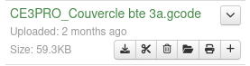
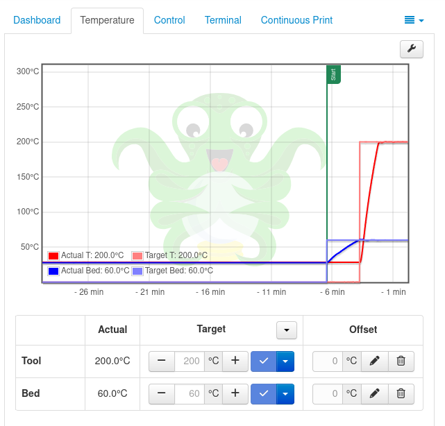

# Lancement de la première impression via Octoprint

Lors de la premiere impression via Octoprint, il faut:

1. Soit faire un glisser deposer du fichier gcode soit l'uploader sur la plateforme.

2. Ensuite, il faut cliquer sur l'icone en forme d'imprimante au niveau du fichier qu'on veut imprimer.

Des lors, on remarque qu'au niveau des temperatures, celle du plateau monte progressivement a 60 et celle de la buse a 200. Cela se remarque au niveau du graphe et c'est ecrit juste en bas egalement.

Des que les temperatures sus-citees sont atteintes, l'impression en elle meme va commencer. 

On peut arreter l'impression en cliquant sur "Cancel" ou la mettre en pause en cliquant sur "Pause".

Pour toutes les impressions, ce sera a peu pres les memes etapes a quelques details pres en fonction des plugins et des features ajoutes.

