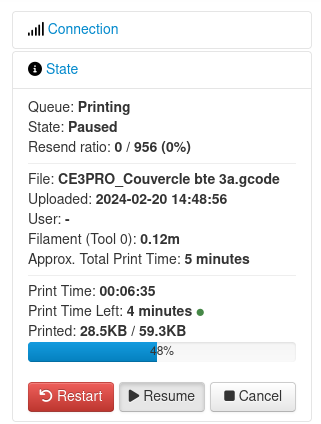
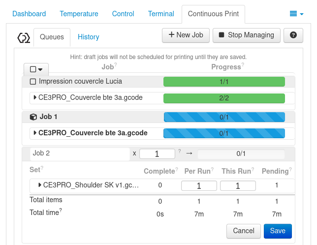

# Mécanisme de mise en place de liste d’attente

## Utilité de la liste d'attente

L'utilité d'une liste d'attente réside dans le fait que meme si une impression est en cours, plusieurs autres peuvent etre rajouté dans l'ordre dans lequel l'on voudrait que les impressions se fassent. De ce fait, dès qu'une impression est terminée, il suffit de:

1. Retirer du plateau ce qui a ete imprimé

2. Appuyer sur le bouton **Resume** pour que l'impression de ce qui suit dans la liste d'attente débute. Cela compte aussi bien lorsque c'est un autre objet qui doit etre imprimé que lorsque le meme objet doit etre imprimé une Nème fois.

## Approche

Lors de la mise en place d'une liste d'attente, j'ai d'abord commencé par éplucher la liste des plugins fournis par Octoprint qui vont dans ce sens. Le premier plugin que j'ai installé **OctoPrint-Queue** et configuré semblait répondre a un besoin principal qui est d'assigner une impression a une personne. Je me disais que cela allait faciliter les choses lors de l'envoi des notifications. Néanmoins, ce plugin ne permettait pas réellement de faire une file d'attente comme cela était décrit dans la description: on ne peut pas ajouter des impressions l'une a la suite de l'autre.
Apres avoir chercher encore et encore de trouver le moyen de faire ma file d'attente, j'ai trouve un plugin qui certes ne permet pas d'assigner une impression a une personne mais permet effectivement de rajouter les impressions l'une a la suite de l'autre. Il s'agit de **Continuous Print**.

## Installation du plugin Continuous Print

Pour l'installation du plugin : 

Allez dans les paramètres en cliquant sur l'icone en forme de clé

Cliquez sur **Plugin Manager** sous OCTOPRINT puis sur **Get more**

Entrez **Continuous Print** au niveau de la barre de recherche puis sur **Install**

Suivez ensuite les instructions pour redémarrer Octoprint

## Paramètrage du plugin Continuous Print

Lors du paramètrage du plugin, vous aurez la possibilité d'activer les paramètres que vous voulez afficher sur votre liste d'attente pendant une impression et désactiver ceux que vous ne désirer pas voir.

## Apercu du plugin Continuous Print

Le liste d'attente affichera lors d'une impression tout ce qui aurait été activé lors du paramètrage. Dans ce cas par exemple, on a accès à toutes les impressions (job et leurs détails(quantité à faire, impression réussie ou non, temps d'impression, quantité de consommable utilisé).
